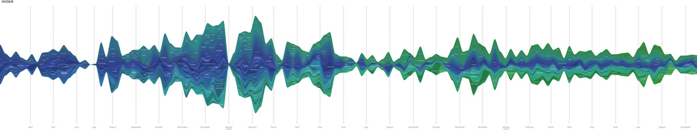

```{r include = FALSE}
# include = FALSE prevents *any* R output or messages from cluttering my neat and tidy document
library("magick")
# read the iamge
my_img <- image_read("resources/rally.jpg")

# how large is the figure?
image_info(my_img)

# scale to width (in pixels) 
my_img  <- image_scale(my_img, "800")

# write scaled versioon to file
image_write(my_img, 
        path = "resources/rally-scaled.jpg", 
        format = "jpg")
```

 
<small>
<br>
<i>Lastfm Graph</i> 
by kjell is licensed under 
<a href="https://creativecommons.org/licenses/by-sa/2.0/0/">CC BY-SA 2.0</a>
<br>
</small>


This portfolio showcases my skill in clear data visualization and ethical visual rhetoric. It is the culmination of my work in the class ME447 Visualising Data. Each display required creating one or more graphics and writing an essay on the data characteristics and my decisions on how to graph it effectively. This class focused on visual rhetoric, which is essentially the process of tailoring graphic decisions to your audience with the goals of clarity and truthfulness.

All of the work done here is using R, a programming language for data manipulation and visualization. At the beginning of this class I did not know what R was, and at the end I am proficient in using it and have created all the displays below.

Gabe Severyn - `r format(Sys.Date(), '%B %Y')`


## Displays and critiques 

[Display 1](reports/D1-report.md) Student demographics and post graduation earnings at US colleges
  This strip plot explores the demographics entering US colleges and their earnings

[Display 2](reports/D2-report.md) US commercial vessels are antiquated
  A multiway reveals a much stronger story than a data table

[Display 3](reports/D3-report.md) Low price and high fuel economy are mutually exclusive
  This scatterplot shows the inverse relationship of these two variables

[Display 4](reports/D4-report.md) Motorsports safety improvements are accelerating
  An ethical display of fatalities in racing, and the equipment that prevents them

[Display 5](reports/D5-report.md) Motorization rate disparity
  Stripping away visual complexity in search of lessons in the data
