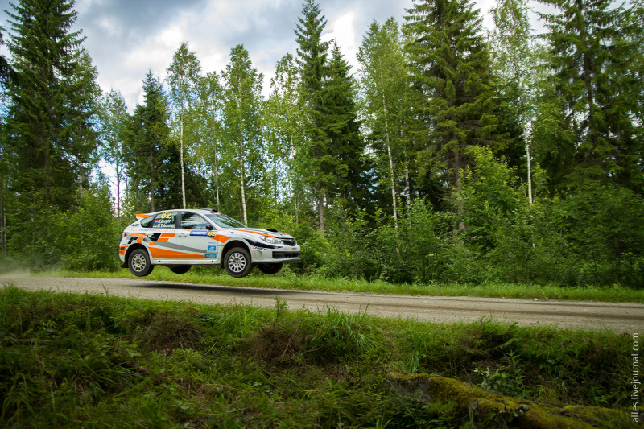

```{r echo = FALSE, message = FALSE, results = 'hide'}
# results = 'hide' prevents any R console output from cluttering my neat document
#knitr::opts_knit$set(root.dir = "../")
library("magick")
# read the iamge
my_img <- image_read("resources/rally.jpg")

# how large is the figure?
image_info(my_img)

# scale to width (in pixels) 
my_img  <- image_scale(my_img, "800")

# write scaled versioon to file
image_write(my_img, 
        path = "resources/rally-scaled.jpg", 
        format = "jpg")
```

 
<small>
<br>
<i>RallyFinland2015-Mokkiperra_82</i> 
by Alles Photos is licensed under 
<a href="https://creativecommons.org/licenses/by-nc/2.0/">CC0 BY-NC 2.0</a>
<br>
</small>

# Portfolio of data displays

This portfolio showcases my skill in clear data visualization and ethical visual rhetoric.

Gabe Severyn - `r format(Sys.Date(), '%B %Y')`


## Displays and critiques 

[Display 1](reports/d1-temp.md) Title of your graph     
State the type of graph (strip plot or box plot) and summarize the main points of the report.

## Discussion notes    
[Reading responses](reports/reading-responses.md) Notes from the data graphics literature on elements of design and visual rhetoric. 

An equation is displayed nicely through LaTeX
$$
x^2 + y^2 = r^2
$$