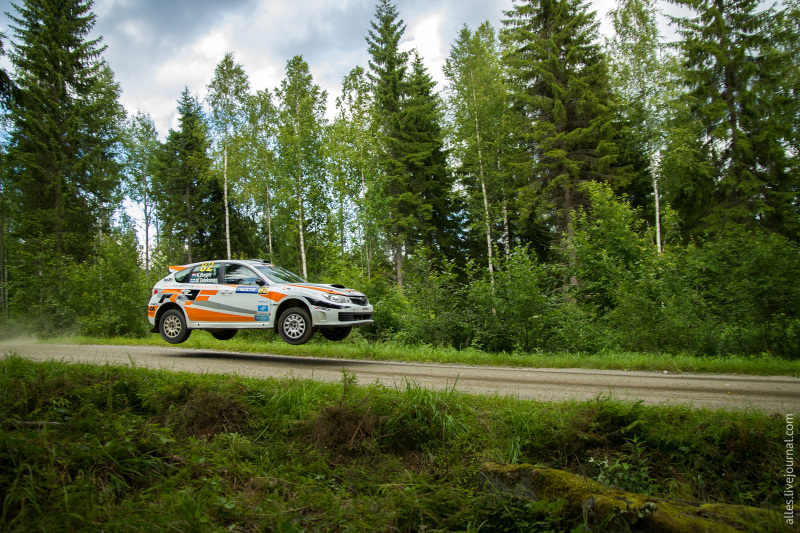

README
================

 <small>  
<i>RallyFinland2015-Mokkiperra\_82</i> by Alles Photos is licensed under
<a href="https://creativecommons.org/licenses/by-nc/2.0/">CC0 BY-NC
2.0</a>   </small>

# Portfolio of data displays

This portfolio showcases my skill in clear data visualization and
ethical visual rhetoric.

Gabe Severyn - April 2020

## Displays and critiques

[Display 1](reports/D1-report.md) Student demographics and post
graduation earnings at US colleges  
This strip plot explores the demographics entering US colleges and their
earnings.

[Display 2](reports/D2-report.md) US commercial vessels are antiquated

## Discussion notes

[Reading responses](reports/reading-responses.md) Notes from the data
graphics literature on elements of design and visual rhetoric.

## Presentation notes

[Presentation responses](reports/presentation-prompts.md) Notes from the
data graphics literature on elements of design and visual rhetoric.

[Reflections on Rhetoric](reports/reflections-on-rhetoric.md) Writing
responses and lessons learned from rhetorical presentations.
