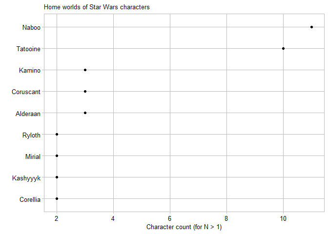

Test Report
================
Gabe Severyn
2020-03-30

    ## Registered S3 method overwritten by 'rvest':
    ##   method            from
    ##   read_xml.response xml2

    ## -- Attaching packages ---------------------------------------------------------------------- tidyverse 1.2.1 --

    ## v ggplot2 3.2.1     v purrr   0.3.2
    ## v tibble  2.1.3     v dplyr   0.8.3
    ## v tidyr   1.0.0     v stringr 1.4.0
    ## v readr   1.3.1     v forcats 0.4.0

    ## -- Conflicts ------------------------------------------------------------------------- tidyverse_conflicts() --
    ## x dplyr::filter() masks stats::filter()
    ## x dplyr::lag()    masks stats::lag()

## Introduction

This display illustrat es the distribution of speeds attained by skiers
in three downhill events in the 2012 Olympic Winter Games disaggregated
by sex.

## Requirements

This display meets the data requirements for D1 distributions

  - 250 observations
  - One quantitative variable (speed)
  - Two categorical variables: sex (2 levels) and event (3 levels)

This display also meets the following document requirements

  - sports data limit (this display is one of two)

The following is a glimpse of StarWars characters.

    ## Observations: 87
    ## Variables: 13
    ## $ name       <chr> "Luke Skywalker", "C-3PO", "R2-D2", "Darth Vader", ...
    ## $ height     <int> 172, 167, 96, 202, 150, 178, 165, 97, 183, 182, 188...
    ## $ mass       <dbl> 77.0, 75.0, 32.0, 136.0, 49.0, 120.0, 75.0, 32.0, 8...
    ## $ hair_color <chr> "blond", NA, NA, "none", "brown", "brown, grey", "b...
    ## $ skin_color <chr> "fair", "gold", "white, blue", "white", "light", "l...
    ## $ eye_color  <chr> "blue", "yellow", "red", "yellow", "brown", "blue",...
    ## $ birth_year <dbl> 19.0, 112.0, 33.0, 41.9, 19.0, 52.0, 47.0, NA, 24.0...
    ## $ gender     <chr> "male", NA, NA, "male", "female", "male", "female",...
    ## $ homeworld  <chr> "Tatooine", "Tatooine", "Naboo", "Tatooine", "Alder...
    ## $ species    <chr> "Human", "Droid", "Droid", "Human", "Human", "Human...
    ## $ films      <list> [<"Revenge of the Sith", "Return of the Jedi", "Th...
    ## $ vehicles   <list> [<"Snowspeeder", "Imperial Speeder Bike">, <>, <>,...
    ## $ starships  <list> [<"X-wing", "Imperial shuttle">, <>, <>, "TIE Adva...

    ## [1] "Revenge of the Sith"     "Return of the Jedi"     
    ## [3] "The Empire Strikes Back" "A New Hope"             
    ## [5] "The Force Awakens"       "Attack of the Clones"   
    ## [7] "The Phantom Menace"

Graph of worlds and number of characters all it home.
<!-- -->

This is the output of a separate R script.

    ## Observations: 21
    ## Variables: 2
    ## $ x1 <dbl> 0.0, 0.5, 1.0, 1.5, 2.0, 2.5, 3.0, 3.5, 4.0, 4.5, 5.0, 5.5,...
    ## $ y1 <dbl> 0.00000000, 0.47942554, 0.84147098, 0.99749499, 0.90929743,...

<!-- -->

Aaaand after that brief interruption, we return to StarWars data.

| homeworld |  n |
| :-------- | -: |
| Naboo     | 11 |
| Tatooine  | 10 |
| Alderaan  |  3 |
| Coruscant |  3 |
| Kamino    |  3 |
| Corellia  |  2 |
| Kashyyyk  |  2 |
| Mirial    |  2 |
| Ryloth    |  2 |

————– Must have a space here before the heading line

## Try include\_graphics

Bring it in…

