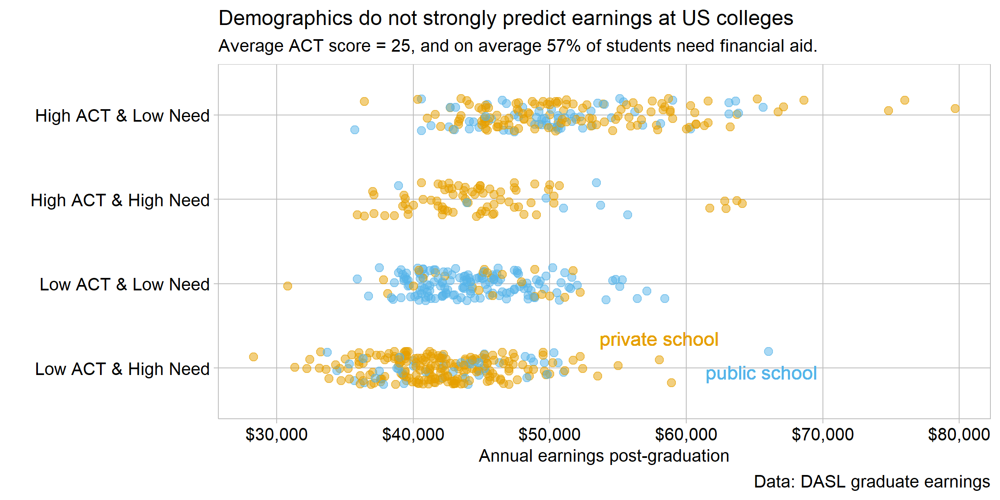

```{r setup, include=FALSE}
library(knitr)
opts_chunk$set(echo = TRUE)

#sometimes this is necessary: pandoc_args: "--webtex=https://latex.codecogs.com/png.latex?"
```

This display meets the requirements for D1 distribution data display: 

  - Minimum 200 observations of one quantitative variable
  - One or two categorical variables
  - Time is excluded as a variable
  - Two categorical variables, with two levels each for a minimum of four comparisons.

This dataset is derived from MONEY's best college rankings. This is an annual study done on colleges in the US focusing on identifying schools that offer the most value to students and their families, as well as top performers in various academic metrics. One important piece of background information this dataset is missing is the year the study refers to. From browsing MONEY's recent college ranking lists, I determined this dataset is from no later than 2014. Missing this context surrounding the data limits the conclusions we can draw - i.e. prospective college students should not place stock in analysis from this display, and should seek the most recent information. However, at the time this data was current, it offered insights into the profile of students entering colleges across the US.


```{r echo = FALSE, out.width = "80%"}   
    
```

Each datapoint is one of the 706 four-year colleges MONEY studied that year, which are colleges in the Unites States meeting a [few criteria](https://money.com/how-money-ranks-best-colleges-2019/). Earnings is the average salary of graduates five years out. The ACT test score is reported as the median for incoming students, which is broken up into higher than average and lower than average categories. Financial need is reported as the fraction of students which recieve financial aid. It only counts aid given for need (not academic merit), but there is no distinction made between federal aid and private scholarships. The average ACT score is 25, and the average percentage of students needing aid is 57%.

Choosing the correct data to include in a report is incredibly important because "displays of evidence implicitly but powerfully define the scope of the relevant, as presentd data are selected from a larger pool of material" [@Tufte:1997] This subset of data divides each college's student body into a demographic based on economic status and academic performance, a combination not often examined. The relevant matter is the distribution of post-graduate earnings by the financial-academic demographic categories. This combination brings stereotypes to the forefront: the 'have-it-alls' (affluent and smart), or the underpriveleged youth (poor test scores and low-income).

Stereotypes are based in truth, and we see that in this graphic. Demographics are ordered by median salary, and as most people would expect, colleges with a high median ACT score produce graduates that tend to be high earners. However, looking deeper this graphic tells a different story. Earnings between each demographic category overlap greatly. In fact, there is only an $8,200 difference between the highest and lowest median earnings. The demographics that attend a college are not a significant factor in determining earnings after college.

## References

[Data source](https://dasl.datadescription.com/datafile/graduate-earnings/)

[Information on the data](https://money.com/how-money-ranks-best-colleges-2019/)