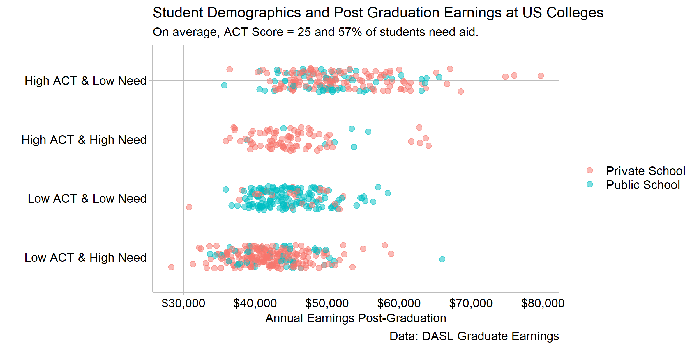

Demographics do not predict earnings at US colleges
================

## Story

College earnings are not strongly predicted by the demographics of
students entering schools.

This dataset is derived from MONEY’s best college rankings. This is an
annual study done on colleges in the US focusing on identifying schools
that offer the most value to students and their families, as well as top
performers in various academic metrics. Each datapoint is one of the 706
(Minimum of 200 for D1) four-year colleges MONEY studied that year,
which are colleges in the Unites States meeting a [few
criteria](https://money.com/how-money-ranks-best-colleges-2019/).

The distribution of earnings by the financial-academic demographic
categories brings stereotypes to the forefront: the ‘have-it-alls’
(affluent and smart), or the underpriveleged (lower test scores and
low-income families). Stereotypes at their core are based in truth, and
some will see that reinforced in this graphic. The demographic ategories
are ordered by median salary, and as most would expect, colleges with a
high median ACT score produce graduates that tend to be high earners.
However, looking deeper this graphic tells a different story. Earnings
between each demographic category overlap greatly. In fact, there is
only an $8,200 difference between the highest and lowest median
earnings. The demographics that attend a college are not a significant
factor in determining earnings after college.

Earnings is the average salary of graduates five years out. The ACT test
score is the median for incoming students at each college, which is
broken up into higher than average and lower than average categories.
Financial need is reported as the fraction of students which recieve
financial aid, broken into above and below average categories. It only
counts aid given for need (not academic merit), but there is no
distinction made between federal aid and private scholarships. The
values splitting the categories are displayed in the figure subtitle:
average ACT score is 25, average percentage of students needing aid is
57%.

One important piece of background information this dataset is missing is
the year the study refers to. From browsing MONEY’s recent college
ranking lists, I determined this dataset is from no later than 2014.
Missing this context surrounding the data limits the conclusions we can
draw - i.e. prospective college students should not place stock in
analysis from this display, and should seek the most recent information.
However, at the time this data was current, it offered insights into the
profile of students entering colleges across the US.

## Graph design

According to Doumount, a strip plot is effective for comparing data with
one continuous variable and one or more categorical variables (Doumont,
[2009](#ref-Doumont:2009)). The collegiate earnings dataset fits this
criteria, and we are interested in comparing the earnings of each
demographic making a strip plot appropriate. The resulting graphic shows
the distribution of the single quantitative variable (earnings) over the
two categorical variables (ACT score and need amount), with two levels
each (above and below average). None of the variables are time based, as
those are best represented with different types of graphs.

Choosing the correct data to include in a report is incredibly important
because “displays of evidence implicitly but powerfully define the scope
of the relevant, as presentd data are selected from a larger pool of
material” (Tufte, [1997](#ref-Tufte:1997)). This subset of data divides
each college’s student body into a demographic based on economic status
and academic performance, a combination not often examined.

The x-axis is formatted with dollar signs and trailing zeros directly on
the labels, because this is the way people are used to looking at
currency values. In this form, the numeric value is understood at a
glance. This format is possible because the axis has few major grid
lines, so the longer labels do not overlap or impede readability.

The need-performance demographic is constructed by the author, so to
improve transparency the values that split the categories is included as
a subtitle. With this additional information, a student identify the
potential earnings range for a college that accept students with similar
scores. Including the average values is also an ethical requirement;
disclosing how categories were created means the author cannot hide
misleading information.

## References

[Data
source](https://dasl.datadescription.com/datafile/graduate-earnings/)

[Information on the
data](https://money.com/how-money-ranks-best-colleges-2019/)

Doumont J-L (2009) Designing the graph. *Trees, maps, and theorems:
Effective communication for rational minds*. Principiae, Kraainem,
Belgium, 133–143 <http://www.treesmapsandtheorems.com/>

Tufte E (1997) The decision to launch the space shuttle Challenger.
*Visual and statistical thinking: Displays of evidence for making
decisions*. Graphics Press, Cheshire, CT, 16–32
<https://www.edwardtufte.com/tufte/books_textb>

