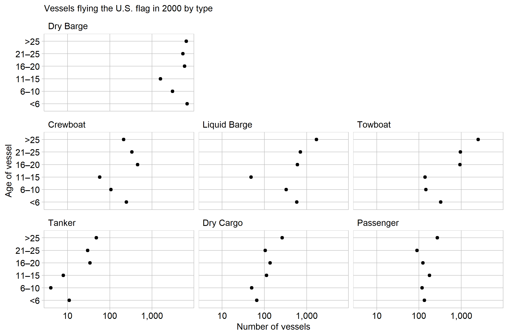

```{r setup, include=FALSE}
library(knitr)
opts_chunk$set(echo = TRUE)
```

Commercial vessels based in the United States are pushing the limits of ship design life. In nearly all types, there are more vessels over 25 years old than in any other age range. Typical design life for commercial maritime vessels is 20-30 years [@Dinu+Ilie:2015]. This means a large portion of the US fleet is operating at near or past the designed service life.

```{r echo = FALSE, out.width = "90%"}   
    
```

However, operating ships beyond designed limits is not uncommon in the maritime shipping industry. In 2013, the global average age of a ship was over 20 years [@Dinu+Ilie:2015]. Given the massive costs to design, construct, and operate large vessels, owners want to maximize their life and return on investment.

There are a few exceptions to the trend of operating old vessels. There are more tankers <6 years old than expected because The Oil Pollution Act (OPA) of 1990, prompted by the Exxon Valdez environmental disaster, began to require double-hull vessels as an added protection against oil spills. This required replacing  ships with new ones. However, there is still a lot of updating to do, because 84% of the US tanker fleet is over 16 years old. *?!?!? investigate any visual anomalies: crewboat >25 should be larger*

Freight Facts and Figures is a report published by the Bureau of Transportation chock full of data on the transportation of goods in and around the US. It is intended to provide "a snapshot" of the industry to help "decision makers, planners, and the public understand the magnitude and importance of freight transportation to the economy" [@FFF:2017]. This lofty goal is not achieved well, because the writers just did not have much to say. Below is their 'snapshot' of the water-going vessels the US economy relies on.

```{r echo = FALSE, out.width = "80%"}   
include_graphics("../resources/FFF-table-3-9.png")    
```

If I was a decision-maker, I would decide to look elsewhere to find more informative evidence.Prose surrounding the table offers no meaningful conclusions, only mentioning the size of the fleet decreased between 2000 and 2014 [@FFF:2017]. A cluttered table may be acceptable for compactly publishing data, but not for presenting findings or furthering the public's understanding. Re-flowing this data into a graphical form is far more informative.

## Graph design

A multiway is appropriate for this data because it is coordinatized; each measurement can be fully identified by keys type and age [@Mount:2017]. A multiway representes coordanitized data well because it shows a single numerical value under two categorical variables. The original data is presented in percentage form; this allows easy comparison of the age in a single type, but inhibits comparison between types. I have converted the data to raw numbers, so comparison across types is easier. This involved a lot of data wrangling, because the type totals are presented in a separate row.

The plots use a log scale, because the counts span three orders of magnitude. This scale allows visual differentiation of the smaller values. Labels for numbers of vessels are sparse enough to read as full numbers with no overprinting, and are formatted with commas for immediate readability. The age category is ordered in increasing order, as it would be if it was a numerical variable. Ordering the age categories in any other way would cause confusion.

Both variations of the multiway were examined, switching the facet and y axis categories. The multiway presented above better aligns the visual logic with the arguments I make in prose. Using vessel type on the y axis and faceting by age highlighted the numerical distribution of vessel types. For example, it showed that dry barges are the most numerous vessels and tankers are the least common. 


## References
