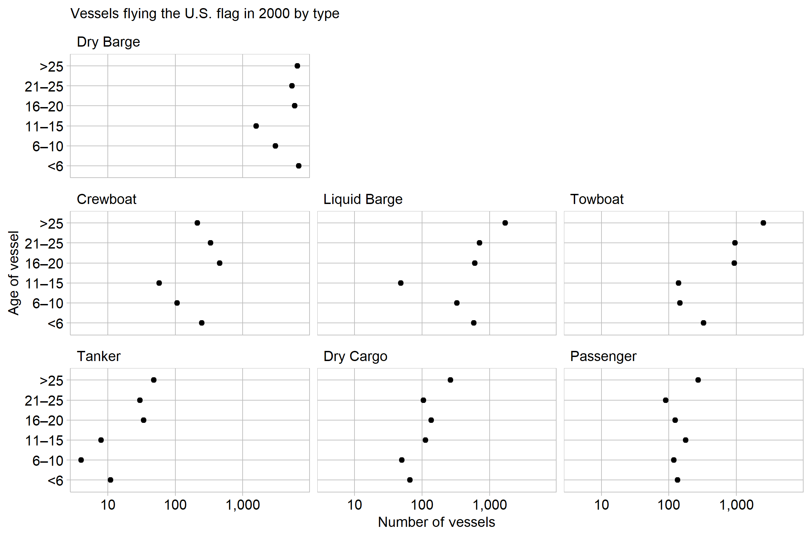
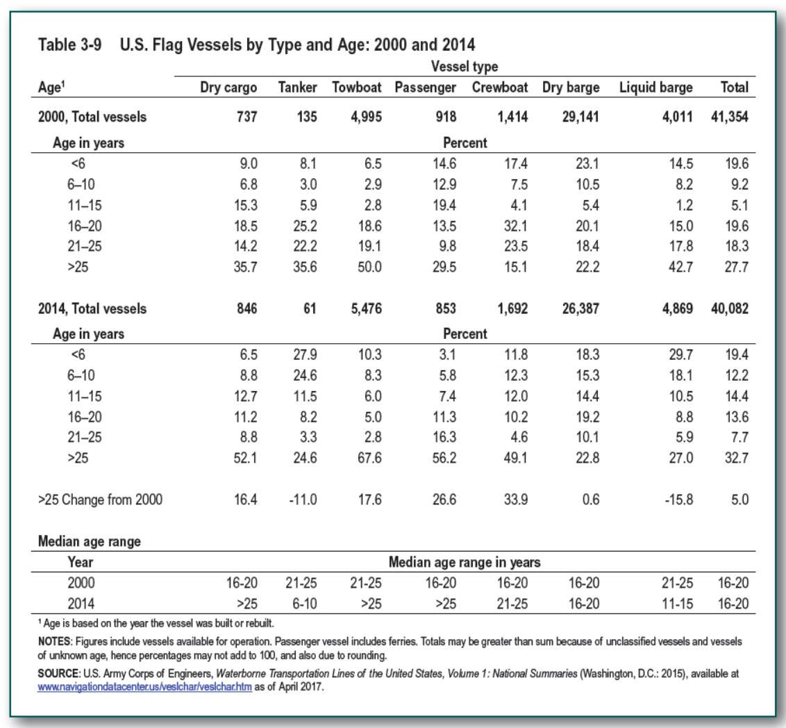

US commercial vessels are antiquated
================

Commercial vessels based in the United States are pushing the limits of
ship design life. In nearly all types, there are more vessels over 25
years old than in any other age range. Typical design life for
commercial maritime vessels is 20-30 years (Dinu and Ilie,
[2015](#ref-Dinu+Ilie:2015)). This means a large portion of the US fleet
is operating at near or past the designed service life.

However, operating ships beyond designed limits is not uncommon in the
maritime shipping industry. In 2013, the global average age of a ship
was over 20 years (Dinu and Ilie, [2015](#ref-Dinu+Ilie:2015)). Given
the massive costs to design, construct, and operate large vessels,
owners want to maximize their life and return on investment.

There are a few exceptions to the trend of operating old vessels.
Crewboats are the only vessel type where \>25 years old is not the
largest category, which I could not find an explanation for. There are
more tankers \<6 years old than expected because The Oil Pollution Act
(OPA) of 1990, prompted by the Exxon Valdez environmental disaster,
began to require double-hull vessels as an added protection against oil
spills. This required replacing ships with new ones. However, there is
still a lot of updating to do, because 84% of the US tanker fleet is
over 16 years old.

This data came from Freight Facts and Figures, a report published by the
Bureau of Transportation chock full of data on goods transportation in
and around the US. It is intended to provide “a snapshot” of the
industry to help “decision makers, planners, and the public understand
the magnitude and importance of freight transportation to the economy”
(Chao and others, [2017](#ref-FFF:2017)). This lofty goal is not
achieved well, because the writers just did not have much to say. Below
is their ‘snapshot’ of the water-going vessels the US economy relies on.

The third section of the table is relevent- the median age of vessel
types. Perhaps the report writers knew the fleet was aging, and tried to
bring attention to it. However, in graphing the data that story becomes
more evident. Prose surrounding the table offers no further conclusions,
only mentioning the size of the fleet decreased between 2000 and 2014
(Chao and others, [2017](#ref-FFF:2017)).

## Graph design

Data requirements:

  - One quantitative variable with a minimum of 24 observations
  - Two independent categorical variables with one of the following
    combinations,
      - 3 levels in category 1 and at least 8 levels in category 2
      - 4 levels in category 1 and at least 6 levels in category 2
      - 5 levels in category 1 and at least 5 levels in category 2

A multiway is appropriate because this data consists of a single
quantitative value with two categorical variables. The original data is
presented in percentage form; this allows easy comparison of the age
within a single type, but inhibits comparison between types. To
facilitate this, I converted the data to raw counts. This involved
difficult data wrangling, because the totals of each type were presented
in a separate row.

The plots use a log scale, because the counts span three orders of
magnitude. This scale allows visual differentiation of the smaller
values. Labels for numbers of vessels are sparse enough to read as full
numbers with no overprinting, and are formatted with commas for
immediate readability. The age category is ordered in increasing order,
as it is a numerical variable. Ordering the age categories in any other
way would cause confusion.

Both variations of the multiway were examined, switching the facet and y
axis categories. The multiway presented above better aligns the visual
logic with the arguments I make in prose. Using vessel type on the y
axis and faceting by age highlighted the numerical distribution of
vessel types. For example, it showed that dry barges are the most
numerous vessels and tankers are the least common.

The source for data was complete, as there are no missing values in the
published table. Therefore, nothing needed to be done to visualize or
correct for missing values.

There are several design choices implemented in the theme of the graph.
This theme gives a consistent look to each graph in my portfolio, aiding
professionalism and cohesiveness of the displays. It uses a white
background (where the default is gray) to reduce non-data ink \[Tufte\].
The font size for the title, labels, and caption are the same size and
of the same font and color to reduce the visual distraction, and make
the data prominent (Robbins,
[2013](#ref-Robbins:2013a)[a](#ref-Robbins:2013a)). The theme includes
(non-distracting) gridlines to facilitate numerical comparison across
facets, such as in the multiway above. Both x and y axis scales are only
written once, but the position of points in rows and columns is clear
because of the consistent gridlines. This also enforces using the same
scale for multiple panels, important to not present misleading graphics
(Robbins, [2013](#ref-Robbins:2013b)[b](#ref-Robbins:2013b)). A title is
included to restate the headline story of the graphic, emphasizing not
what data is shown, but why that data is relevent to an argument.
Lastly, a caption is included for sourcing of the data. Together, all of
these choices make a more useful graph to the viewer and reduce the
possibility of comitting rhetorical mistakes.

## References

Chao E, Rosen J, Hu P and Schmitt R (2017) *Freight Facts and Figures.*,
12th edn. U.S. Department of Transportation, Bureau of Transporation
Statistics [www.bts.gov](www.bts.gov)

Dinu O and Ilie AM (2015) Maritime vessel obsolescence, life cycle cost
and design service life. *IPO Conference Series: Material Science and
Engineering* **95**
<https://iopscience.iop.org/article/10.1088/1757-899X/95/1/012067/pdf>

Robbins N (2013a) General principles for creating effective graphs.
*Creating More Effective Graphs*. Chart House, Wayne, NJ, 154–225
<http://www.nbr-graphs.com/resources/recommended-books/>

Robbins N (2013b) Scales. *Creating More Effective Graphs*. Chart House,
Wayne, NJ, 226–291
<http://www.nbr-graphs.com/resources/recommended-books/>

