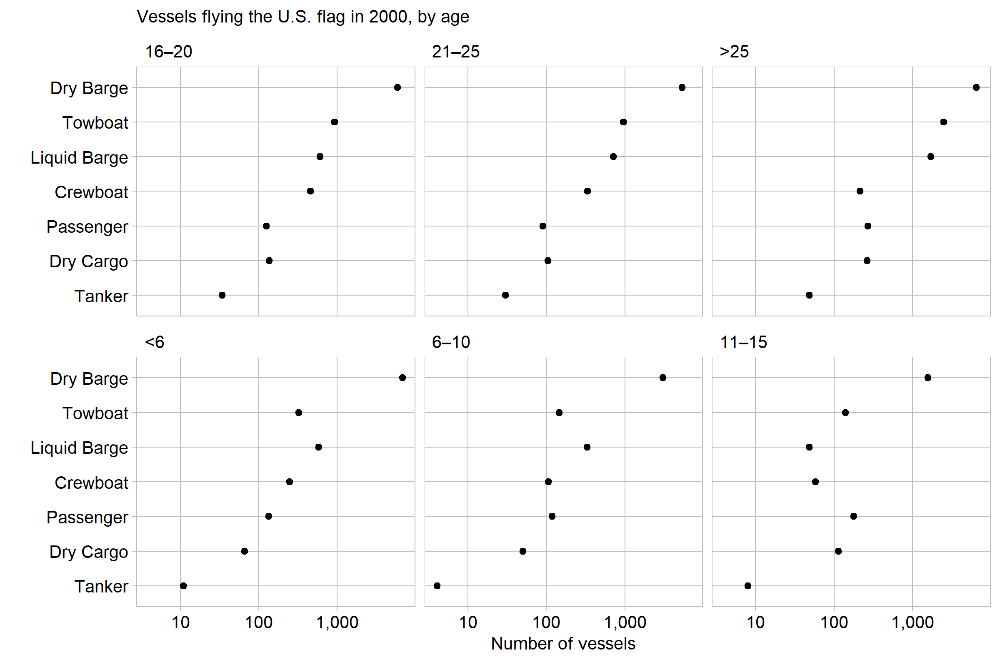

US commercial vessels are antiquated
================

## Story

Freight Facts and Figures is a report published by the Bureau of
Transportation chock full of data on the transportation of goods in and
around the US. It is intended to provide “a snapshot” of the industry to
help “decision makers, planners, and the public understand the magnitude
and importance of freight transportation to the economy” (Chao and
others, [2017](#ref-FFF:2017)). This lofty goal is not achieved well.
Below is their snapshot of the water-going vessels the US economy relies
on.

If I was a decision-maker, I would decide to look elsewhere for more
digestible evidence. A cluttered table may be acceptable for compactly
publishing data, but not for presenting findings or furthering the
public’s understanding. Prose surrounding the table offers no meaningful
conclusions, only mentioning the size of the fleet decreased between
2000 and 2014 (Chao and others, [2017](#ref-FFF:2017)). Re-flowing this
data into a graphical form is far more informative.

There are more tankers \<6 years old than expected by the trend, because
The Oil Pollution Act (OPA) of 1990, prompted by the Exxon Valdez
environmental disaster, began to require double-hull vessels as an added
protection against oil spills. This required replacing existing existing
ships with new ones. However, there is still a lot of updating to do,
because 84% of the US tanker fleet is over 16 years old.

Below is the multiway’s dual, which does not provide as useful a
summary. Ordering the panels by age highlights the distribution of
vessel types, showing for example that dry barges are the most numerous
vessels and tankers are the least common - a story not of great value.

“U.S. flag vessels include a wide range of vessel types that are used to
move freight around the globe. However, shallow draft vessels (barges
and towboats) make up 93.8 percent of the fleet and operate domestically
on intracoastal waterways and river systems. Our inland waterways
provide an alternative to truck and rail transportation, a barge can
carry an amount equal to or greater than 15 railcars or 60 large
semi-truck trailers. Overall, the U.S. fleet decreased by more than
1,272 vessels (3.1 percent) between 2000 and 2014, largely due to the
retirement of dry bulk barges. An increase in the percentage of tankers
and liquid bulk barges 10 or less years old was largely driven by The
Oil Pollution Act (OPA) of 1990, which required double hulls by January
1, 2015. Double hulls provide greater protection to the marine
environment from spills caused by collisions or groundings.” (42)

investigate any visual anomalies: LB-11-15, Towboat 6-10, or more

## Graph design

A multiway is appropriate for this data because it is coordinatized;
each measurement can be fully identified by keys type and age (Mount and
Zumel, [2017](#ref-Mount:2017)). A multiway representes coordanitized
data well because it shows a single numerical value under two
categorical variables. The original data is presented in percentage
form; this allows easy comparison of the age in a single type, but
inhibits comparison between types. I have converted the data to raw
numbers, so comparison across types is easier. This involved a lot of
data wrangling, because the type totals are presented in a separate row.

The plots use a log scale, because the counts span three orders of
magnitude. This scale allows visual differentiation of the smaller
values. Labels for numbers of vessels are sparse enough to read as full
numbers with no overprinting, and are formatted with commas for
immediate readability. The age category is ordered in increasing order,
as it would be if it was a numerical variable. Ordering the age
categories in any other way would cause confusion.

## References

Chao E, Rosen J, Hu P and Schmitt R (2017) *Freight Facts and Figures.*,
12th edn. U.S. Department of Transportation, Bureau of Transporation
Statistics [www.bts.gov](www.bts.gov)

Mount J and Zumel N (2017) Coordinatized Data: A Fluid Data
Specification.
<http://winvector.github.io/FluidData/RowsAndColumns.html>

