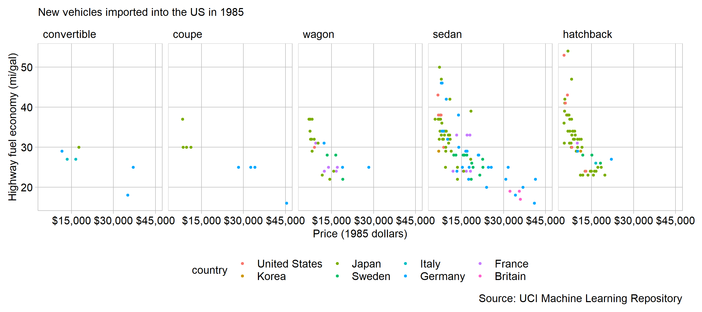
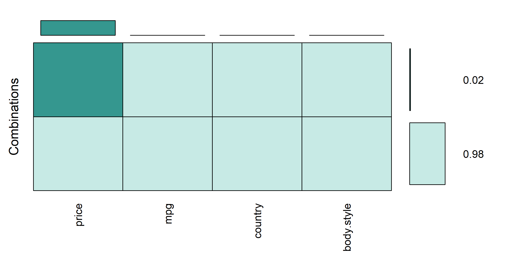

```{r setup, include=FALSE}
library(knitr)
opts_chunk$set(echo = TRUE)
```

There is a strongly inverse correlation between vehicle price and highway fuel economy. Of the cars imported into the US in 1985, there were not expensive cars that achieved good fuel economy nor were there inexpensive cars with poor fuel economy [@Dua:2017].

```{r echo = FALSE, out.width = "100%"}   
    
```

An explanation of the trend can be traced back to companies producing products that satisfy consumer preferences. Simply put, brands make cars people want to buy. The explanation make sense from the view of the producer targeting potential consumers. No conclusions can be made about which vehicles actually appealed to consumers and sold, since this data does not include sales or profit information.

Sedan and hatchbacks and wagons strongly exhibit an inverse correlation between price and economy. A budget conscious shopper prioritizes low overall costs: made up of both initial price and operating costs in fuel. Hatchbacks are the lowest cost style of car, and also have some of the highest fuel economy numbers.

Buyers of more expensive cars have different priorities than those of hatchbacks and sedans. All of the vehicles around and above the $30,000 are Porsche, a luxury-performance brand, or Mercedes-Benz, the gold-standard of luxury cars. Buyers willing to spend that much prefer cars to be comfortable, have a certain status, or have high performance. Overall, there was no real correlation between fuel economy and country of origin, which was explored.

There are a few contextual issues with this data. It does not represent domestic manufacturers well, because any american models are merely captive-imports: models built by overseas manufactures but sold under domestic brands. For inexplicable reasons it does not include trucks either. The US was the largest automobile market at at the time, so the trends seen in this data likely represent the global trends. 

Extending this data to include domestic cars may provide additional context to this story. Perhaps foreign companies produce more economical cars because the domestic producers are leaving that market segment empty. This story would be dramatically different with data from current years (post 2010). Both because automotive market segments are more diverse than ever, and because of recent focus on fuel efficiency and electrification. How would current market trends compare to those of 1985? Do current luxury cars still get poor fuel economy? As always, there are more questions than answers.

## Graph design
 
A scatterplot is appropriate for this data because the main interest is showing the correlation between two continuous quantitative varibles [@Doumont:2009]. Body style and country of origin are ancillary variables, included for context and to further the story but they play second fiddle to the scatterplot correlation.

Both factors are ordered by economy, which easily shows which style and brand are the most efficient. Ordering the panels by increasing median economy is more effective than ordering the styles alphabetically [@Robbins:2013b].

This graphic uses the standard theme as discussed in the [D2 report](https://github.com/severygb/portfolio-severyn-gabe/blob/master/reports/D2-report.md). Price is formatted in currency form, which enables immediate understanding. Care was taken to eliminate label overprinting by changing the axis scale to thousands, eliminating all of the trailing zeros. Much of the data in hatchback and sedan is closely clustered, so a slight transparency is added to the points.

One of Wainer's sarcastic visualization rules is "emphasize the trivial, ignore the important" [@Wainer:2000]. He means to place important comparisons such that they are easy to make. To facilitate comparing mileage across each body style, it is placed on the y-axis, which is common for all facets. Additionally, body style is a more important factor in correlating price and economy so it is separated as panels, while country of origin is relegated to colors because it is secondary.

I continue to have good luck and pick [datasets](https://archive.ics.uci.edu/ml/datasets/Automobile) with very little missing data. Of the variables used in this display, only price contains missing values (4 in 205 observations, 2%). The spine chart below shows that the missing values are split between the most common body styles (hatchback and sedan). From this, we conclude the missing values are not biased to a certain body style and do not significantly change the visual story.

```{r echo = FALSE, out.width = "60%"}   
    
```

The few problematic observations are omitted from the graph.

Pulled from a repository for machine learning, this data set strongly resembles the mtcars data included in R. This was not intentional, I just sought out data on cars because that's what I am interested in, and found the similarity through tutorials that used mtcars.

## References
