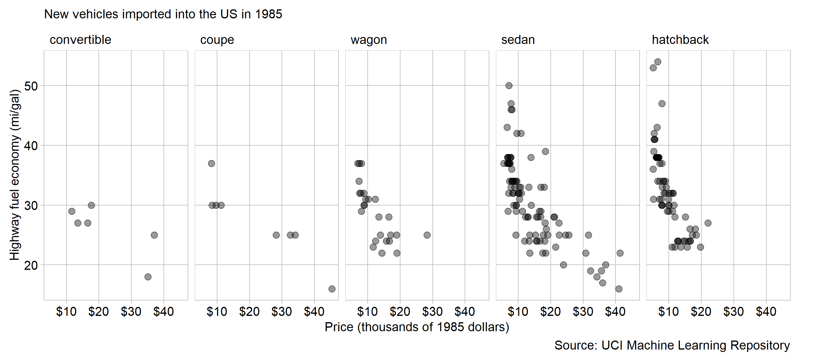

```{r setup, include=FALSE}
library(knitr)
opts_chunk$set(echo = TRUE)
```

There is a strongly inverse correlation between vehicle price and highway fuel economy. Of the cars imported into the US in 1985, there were not expensive cars that achieved good fuel economy nor were there inexpensive cars with poor fuel economy [@Dua:2019].

```{r echo = FALSE, out.width = "100%"}   
    
```

An explanation of the trend can be traced back to companies producing products that satisfy consumer preferences. Simply put, brands make cars people want to buy- theoretically. The following explanations make sense from the view of the producer targeting consumers. No conclusions can be made about which vehicles actually appealed to consumers and sold, since this data does not include sales or profit information.

Sedan and hatchbacks and wagons strongly exhibit an inverse correlation between price and economy. A budget conscious shopper prioritizes low overall costs: made up of both initial price and operating costs in fuel. Hatchbacks are the lowest cost style of car, and also have some of the highest economy numbers.

Buyers of more expensive cars have different priorities than those of hatchbacks and sedans. Around and above the $30,000 mark exist only Porsche, a luxury-performance brand, and Mercedes-Benz, the utmost in luxury cars. These buyers prefer cars to be comfortable, powerful, or have high performance. 

There are a few things wrong with this data. It does not represent domestic manufacturers well, because any american models are merely captive-imports: models built by overseas manufactures but sold under domestic names. For inexplicable reasons it does not include trucks either. This limited view is still meaningful however, because the US was the largest automobile market at the time.

Finding this data for domestic cars may provide additional context to this story. Perhaps foreign companies produce more economical cars because the domestic producers are leaving that market segment empty. I am sure this story would be drastically different with data from current years, both because automotive market segments are more diverse than ever and because of recent focus on economy and electrification. As always, there are more questions than answers.


## Graph design
 
Data requirements

- Minimum 100 observations
- Two quantitative variables
- One categorical variable with at least 5 levels
- Time is excluded as a variable

A scatterplot is appropriate for this data because the main interest is showing the correlation between two continuous quantitative varibles [@Doumont:2009]. Body style and country of origin are ancillary variables, included for context and to further the story, but they play second fiddle to the scatterplot correlation.

Both factors are ordered by economy, which easily shows which style and brand are the most efficient. Who said "order by the data"?

Price is formatted in standard currency form, which enables immediate understanding. Care was taken to eliminate label overprinting- the exact opposite of clarity.

One of Wainer's sarcastic visualization rules is "emphasize the trivial, ignore the important" [@Wainer:2000]. He means to place important comparisons such that they are easy to make. To facilitate comparing mileage across each body style, it is placed on the y-axis, which is common for all facets. Additionally, body style is a more important factor in correlating price and economy so it is separated as panels, while country of origin is relegated to colors because it is secondary.

Pulled from a repositoty for machine learning, this data set strongly resembles the mtcars data included in R. This was not intentional, I just sought out data on cars because that's what I am interested in, and found the similarity through tutorials that used mtcars.

## References
