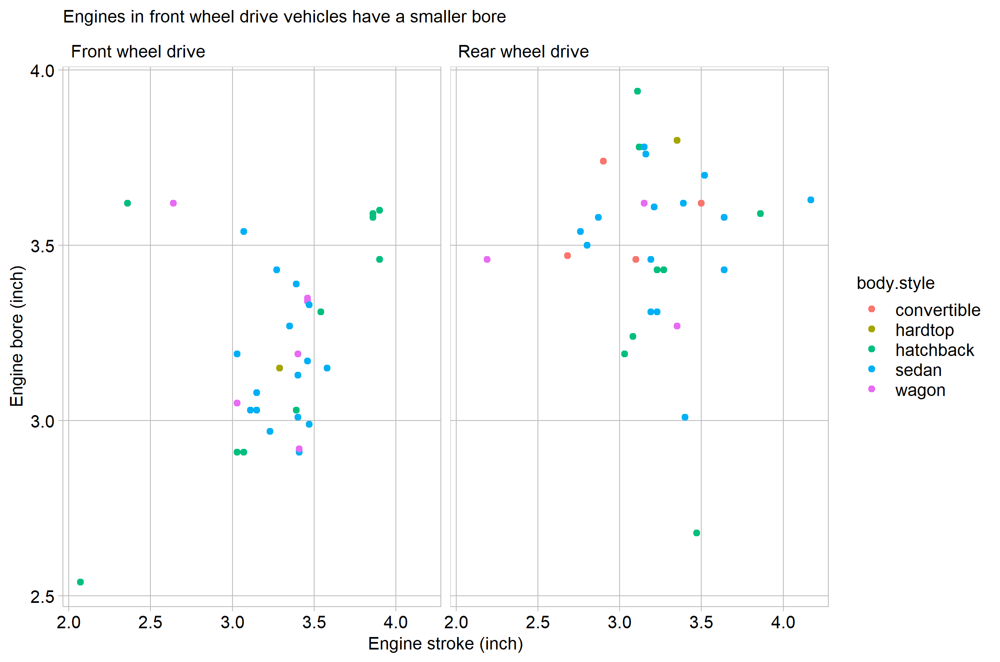

```{r setup, include=FALSE}
library(knitr)
opts_chunk$set(echo = TRUE)
```


```{r echo = FALSE, out.width = "90%"}   
    
```


## Graph design
 
Data requirements

- Minimum 100 observations
- Two quantitative variables
- One categorical variable with at least 5 levels
- Time is excluded as a variable


## References
