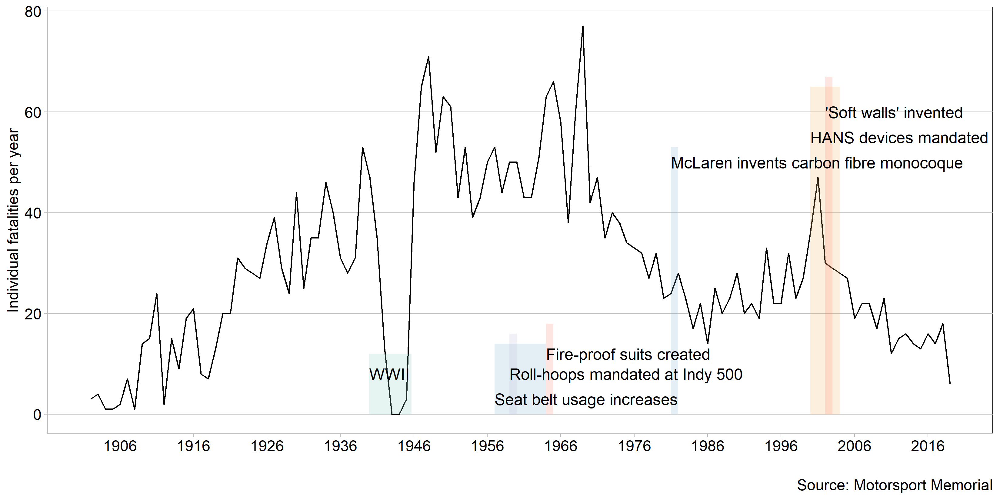

```{r setup, include=FALSE}
library(knitr)
opts_chunk$set(echo = TRUE)
```

There are three primary threats to a driver: high g-load, object intrusion, and fire [@Smith:2019]. Though the first car race is rumored to have occured soon after the creation of the second car, the global motorsports community only began to look at crashes and injuries in a scientific manner in the 1990's, furthering technology for safety improvements and studying how to mitigate risks for drivers, crew members, and spectators [@Tyler:2006].

This data only includes car and truck racing (not motorcycles or boats) in the US. Motor racing is a global sport, so there are many individuals and race series that are not accounted for here. The vast majority of individuals killed in the sport are drivers, but incidents can happen anywhere on and off track and over the last hundred years spectators, crew members, and safety


```{r echo = FALSE, out.width = "100%"}   
    
```


There is a story here that this graph does not address - the data I obtained makes no distinction between professional and amateur drivers. A national or international series, such as NASCAR or F1, has the resources and knowledge to drive advancements in safety technology, and the ability to mandate equipment within the series. Professional and manufacture-backed teams have enough budget to afford the safest equipment available. Amateur racing is the exact opposite.

Drivers and teams at local race tracks can not afford top-tier equipment. Local tracks can not afford to fit energy-absorbing wall material at a cost upwards of $500 a foot [@Smith:2019].

There has been a trickle-down effect for safety improvements, especially in helmets, restraint harnesses, fuel cells, and the knowledge to build a strong driver protection cabin. Even the budget-centric racing series 24 Hours of LeMons, where cars must cost below $500, enforces *strict* safety protocols for crash safety and fire prevention.


## Graph design
 
Data requirements

- Minimum 20 observations
- One quantitative variable conveying information about human injury or fatality
- One or two categorical variables, one of which can be time (time series)

Normalizing the fatalities would be more appropriate in this case because it would account for the changing number of participants. However, after searching, I could not find data for the number of participants across all racing types and series to match the fatalities context.

Why is this graph type appropriate? design decisions, especially citing humanizing the content

## Notes

Racing safety advances:
  HANS devices widely mandated. 2000-2003, [@Tyler:2006]
  nomex fire suits 1964 [@Houston:2012]
  SAFER barriers a.k.a. 'soft' walls, 2002 [@Valentine:2016]
  Carbon fiber monocoque in 1981 by McLaren [@Piola:2016]
  roll-over hoops mandated at Indy 500, 1959 [@Nye:2017]
  seat belts / harnesses, 1957-1963. [@Nye:2017]
  
Not labeled but derseves a mention: helmet improvements, intrusion mitigators (F1 Aeroscreen and Halo)

## References