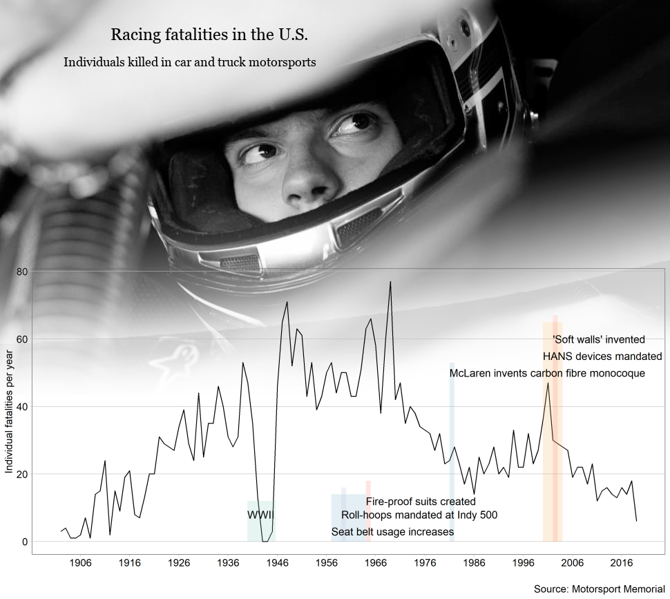

Motorsports safety improvements are accelerating
================

There are three primary threats to a race car driver: high g-load,
object intrusion, and fire (Smith, [2019](#ref-Smith:2019)). Most types
of injuries are caused by accidents involving these threats and
improvements in safety technology primarily target them. Automobile
racing is a recent sport; a popular saying is the first race occurred
shortly after the creation of the second car. However, the global
motorsports community only began to look at crashes and injuries in a
scientific manner in the 1990’s, furthering technology for safety
improvements and studying how to mitigate risks for drivers, crew
members, and spectators (Tyler, [2006](#ref-Tyler:2006)). It took
decades of dangerous competition and major improvements in technology
before the global community coalesced around safety for specatators and
participants. This hundred-odd years of data represents the lives of
drivers, spectators, crew members, safety personel, and officals who
lost their life in a motorsports incident.

This data only includes car and truck racing (not motorcycles or boats)
in the US. Motor racing is a global sport so there are thousands of
individuals and hundreds of race series that are not accounted here. The
vast majority of individuals killed in the sport are drivers but
incidents can happen anywhere on and off track. Small numbers of rescue
personel, team members, and fans are part of this dataset, but every
loss of life is equal in weight and must be included in safety
considerations.

Some of the most influential and effective safety advances are
highlighted for context. There is an accelerating rate in safety
advances; very few improvements happened before the 1950’s but so many
occurred in the past 20 years they could not be labeled. This follows
the rate of technological advances in the information age. The
improvements labeled directly address the three primary threats in
motorsports accidents.

Some important sections of the graph must be noted. During the second
World War fatalities dropped to zero, simply because no motorsports
events happened during the time.

Several of the safety improvements are a direct result of a fatal
accident driving action. In 1958 Pat O’Connor lost his life in major car
pile-up at the Indianapolis 500. The very next year roll over hoops were
mandated (Nye, [2017](#ref-Nye:2017)). There is a spike followed by
continual decline in fatalities at the turn of the 21st century. A
string of high-profile deaths including Dale Earnheardt and Adam Petty
prompted a massive response from the racing community to make changes.
HANS devices were mandated in NASCAR as a direct result of Earnheardt,
since the device directly prevents the type of skull fracture he
suffered (Tyler, [2006](#ref-Tyler:2006)).

There is a story here that this graph does not address - the data I
obtained makes no distinction between professional and amateur drivers.
A national or international series, such as NASCAR or F1, has the
resources and knowledge to drive advancements in safety technology, and
the ability to mandate equipment within the series. Professional and
manufacture-backed teams have enough budget to afford the safest
equipment available. Amateur racing is the exact opposite. Drivers and
teams at local race tracks can not afford top-tier equipment. Local
tracks can not afford to fit energy-absorbing wall material at a cost
upwards of $500 a foot (Smith, [2019](#ref-Smith:2019)). There has been
a trickle-down effect for safety improvements, especially in helmets,
restraint harnesses, fuel cells, and the knowledge to build a strong
driver protection cabin. Even the budget-centric racing series 24 Hours
of LeMons, where cars must cost below $500, enforces *strict* safety
protocols for crash safety and fire prevention.

## Graph design

Data requirements

  - Minimum 20 observations
  - One quantitative variable conveying information about human injury
    or fatality
  - One or two categorical variables, one of which can be time (time
    series)

A line graph is appropriate for this data because it shows the evolution
of a variable over time (Doumont, [2009](#ref-Doumont:2009)). The
variable is not continuous, rather it is discreet over each year. Points
are real data while the line is just connecting the dots, but the line
is easily “understood as connected, but not interpolated, by the line”
(Doumont, [2009](#ref-Doumont:2009)). Markers are not displayed at each
point to keep ink to a minumum and fit the simple and somber theme.
Human suffering is the central focus, not comparing data points or
reducing lives to statistics (Dragga and Voss,
[2001](#ref-Dragga+Voss:2001)).

Normalizing the fatalities would be more appropriate in this case
because it would account for the changing number of participants. That
number likely varies widely between 1902 and 2019, however I was not
able find data for the number of participants across all racing types
and series to match context with the fatalities data.

The first thing the viewer sees the man in a racing helmet and safety
gear. This picture immediately conveys the individuality of lives lost,
showing ‘who’ is affected by this injurious data (Dragga and Voss,
[2001](#ref-Dragga+Voss:2001)). Someone who suffered for their passion,
who participated in a dangerous sport because they loved the feelings,
competition, or community invloved. The man solemly gazing away imparts
a variety of emotions to viewers. Anyone personally involved in
motorsports will recognize the scene: the moment of calm right before
the race starts and chaos has the potential to arise.

The image fades to white beneath the figure with the goal of showing
they are inseparable. Great care was taken to make sure the data lines,
grid lines, and annotation rectangles do not visually conflict, but
rather integrate into a cohesive and “mutually illuminative” display
(Stroupe, [2000](#ref-Stroupe:2000)).

Information encoded in the annotations on racing safety advances comes
from the following sources.

  - HANS devices (Tyler, [2006](#ref-Tyler:2006))
  - nomex fire suits (Houston, [2012](#ref-Houston:2012))
  - SAFER barriers a.k.a. ‘soft’ walls (Valentine,
    [2016](#ref-Valentine:2016))
  - Carbon fiber monocoque (Piola, [2016](#ref-Piola:2016))
  - roll-over hoops (Nye, [2017](#ref-Nye:2017))
  - seat belts / harnesses (Nye, [2017](#ref-Nye:2017))

## References

Background Image: [grayscale photography of a man wearing racing helmet
and
suit](https://www.peakpx.com/214316/grayscale-photography-of-a-man-wearing-racing-helmet-and-suit)
used under license
[CC0](https://creativecommons.org/publicdomain/zero/1.0/deed.en)

Doumont J-L (2009) Designing the graph. *Trees, maps, and theorems:
Effective communication for rational minds*. Principiae, Kraainem,
Belgium, 133–143 <http://www.treesmapsandtheorems.com/>

Dragga S and Voss D (2001) Cruel pies: The inhumanity of technical
illustrations. *Technical Communication* **48**(3), 265–274

Houston R (2012) Dressing the part \[archived\].
<https://web.archive.org/web/20121011234900/http://www.nascar.com/news/121009/ups-game-changer-uniforms/index.html>

Nye D (2017) Doug nye: How safety has advanced in motorsport.
<https://www.goodwood.com/grr/columnists/doug-nye/2017/6/doug-nye-how-safety-has-advanced-in-motorsport/>

Piola G (2016) Tech analysis: The key safety advances that saved
alonso’s life.
<https://www.motorsport.com/f1/news/tech-analysis-the-key-safety-advances-that-saved-alonso-s-life-682435/682435/?nrt=54>

Smith SC (2019) Motorsports safety: What’s next?
<https://www.automobilemag.com/news/motorsports-safety-past-present-future-intrusion-fire-g-loads/>

Stroupe C (2000) *Visualizing English: Recognizing the hybrid literacy
of visual and verbal authorship on the Web.* College English

Tyler M (2006) The history of the hans device as told by dr. Bob hubbard
\[archived\].
<https://web.archive.org/web/20080104173743/http://www.catchfence.com/html/2006/mt032706.html>

Valentine R (2016) Car racing is deadly. This is how we keep drivers
alive. <https://time.com/4546783/auto-racing-barrier-deaths/>

