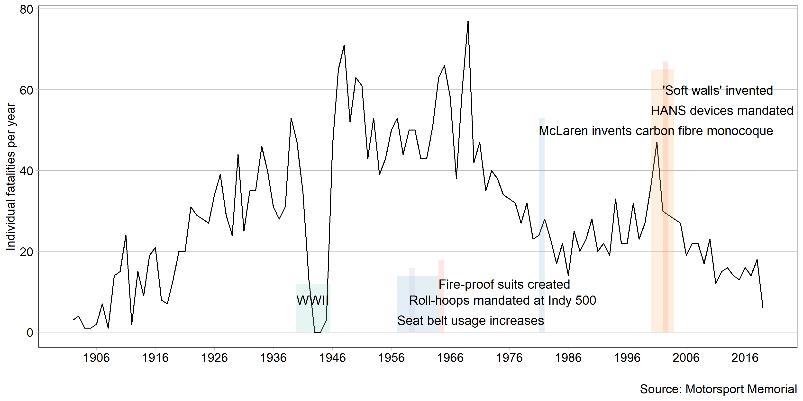

Motorsports safety improvements are accelerating
================

There are three primary threats to a driver: high g-load, object
intrusion, and fire (Smith, [2019](#ref-Smith:2019)). Though the first
car race is rumored to have occured soon after the creation of the
second car, the global motorsports community only began to look at
crashes and injuries in a scientific manner in the 1990’s, furthering
technology for safety improvements and studying how to mitigate risks
for drivers, crew members, and spectators (Tyler,
[2006](#ref-Tyler:2006)).

This data only includes car and truck racing (not motorcycles or boats)
in the US. Motor racing is a global sport, so there are many individuals
and race series that are not accounted for here. The vast majority of
individuals killed in the sport are drivers, but incidents can happen
anywhere on and off track and over the last hundred years spectators,
crew members, and safety

There is a story here that this graph does not address - the data I
obtained makes no distinction between professional and amateur drivers.
A national or international series, such as NASCAR or F1, has the
resources and knowledge to drive advancements in safety technology, and
the ability to mandate equipment within the series. Professional and
manufacture-backed teams have enough budget to afford the safest
equipment available. Amateur racing is the exact opposite.

Drivers and teams at local race tracks can not afford top-tier
equipment. Local tracks can not afford to fit energy-absorbing wall
material at a cost upwards of $500 a foot (Smith,
[2019](#ref-Smith:2019)).

There has been a trickle-down effect for safety improvements, especially
in helmets, restraint harnesses, fuel cells, and the knowledge to build
a strong driver protection cabin. Even the budget-centric racing series
24 Hours of LeMons, where cars must cost below $500, enforces *strict*
safety protocols for crash safety and fire prevention.

## Graph design

Data requirements

  - Minimum 20 observations
  - One quantitative variable conveying information about human injury
    or fatality
  - One or two categorical variables, one of which can be time (time
    series)

Normalizing the fatalities would be more appropriate in this case
because it would account for the changing number of participants.
However, after searching, I could not find data for the number of
participants across all racing types and series to match the fatalities
context.

Why is this graph type appropriate? design decisions, especially citing
humanizing the content

## Notes

Racing safety advances: HANS devices widely mandated. 2000-2003, (Tyler,
[2006](#ref-Tyler:2006)) nomex fire suits 1964 (Houston,
[2012](#ref-Houston:2012)) SAFER barriers a.k.a. ‘soft’ walls, 2002
(Valentine, [2016](#ref-Valentine:2016)) Carbon fiber monocoque in 1981
by McLaren (Piola, [2016](#ref-Piola:2016)) roll-over hoops mandated at
Indy 500, 1959 (Nye, [2017](#ref-Nye:2017)) seat belts / harnesses,
1957-1963. (Nye, [2017](#ref-Nye:2017))

Not labeled but derseves a mention: helmet improvements, intrusion
mitigators (F1 Aeroscreen and Halo)

## References

Houston R (2012) Dressing the part \[archived\].
<https://web.archive.org/web/20121011234900/http://www.nascar.com/news/121009/ups-game-changer-uniforms/index.html>

Nye D (2017) Doug nye: How safety has advanced in motorsport.
<https://www.goodwood.com/grr/columnists/doug-nye/2017/6/doug-nye-how-safety-has-advanced-in-motorsport/>

Piola G (2016) Tech analysis: The key safety advances that saved
alonso’s life.
<https://www.motorsport.com/f1/news/tech-analysis-the-key-safety-advances-that-saved-alonso-s-life-682435/682435/?nrt=54>

Smith SC (2019) Motorsports safety: What’s next?
<https://www.automobilemag.com/news/motorsports-safety-past-present-future-intrusion-fire-g-loads/>

Tyler M (2006) The history of the hans device as told by dr. Bob hubbard
\[archived\].
<https://web.archive.org/web/20080104173743/http://www.catchfence.com/html/2006/mt032706.html>

Valentine R (2016) Car racing is deadly. This is how we keep drivers
alive. <https://time.com/4546783/auto-racing-barrier-deaths/>

