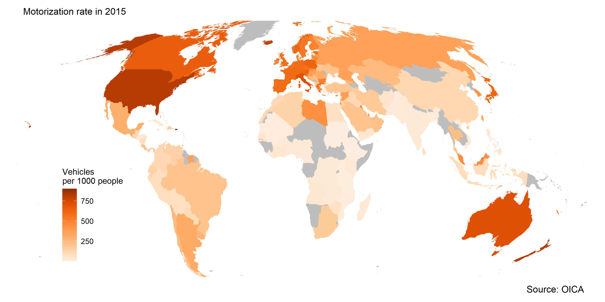

```{r setup, include=FALSE}
library(knitr)
opts_chunk$set(echo = TRUE)
```

The International Organization of Motor Vehicle Manufactures provides [data on the motorization rate](http://www.oica.net/wp-content/uploads//Total_in-use-All-Vehicles.xlsx) of countries across the world. This represents the concentration of passenger and commercial vehicles per capita. This rate is closely correlated with income and urbanization at a national level, and negatively correlated with population density at a local scale [@NAP:2003].

OICA published this [map](http://www.oica.net/category/vehicles-in-use/) meant to summarize their data and present the story at a glance. It falls short in several important ways and presents so much data that it confuses more than it clarifies.

```{r echo = FALSE, out.width = "60%"}   
    
```

The original graphic lies by emphasizing the trivial. Their graphic's title is "Motorization rate 2015," but the information readers see first "Versus 2005", because the giant red bubbles grab attention. The red ovals, plotted overtop the map and larger than almost every country, distract from the data they contain, making them chartjunk [@Tufte:1997]. Overall, the message is hidden in an extremely visually busy graphic. One point the original authors succeeded on is avoiding value laden colors - their scheme has absolutely no hidden meaning. Color can be used to make certain countries or continents more prominent or impart emotional or political biases, but this graphic avoids all of those pitfalls.

The highlighted, underlined, and italicized headings call out continental groupings. Only eight numbers (7 groupings and a global average) would fit in a small table, making the map itself unncesessary, and potentially chartjunk. 

Another source of potential misinformation is not acknowledging missing data. There are over 20 countries not included in the data set with no explanation for why.

To correct the (unintentional) graphical lies in the original publication, I implemented a two stage approach. Each stage strips away superfluous data in the pursuit of conveying the information clearly and concisely. Although all charts (including the original) contain the same data, they do not all convey the same information. The chloropleth map and dot plot are displayed together because "showing data more than one way increases our understanding" [@Robbins:2013b].

## Stage 1: clearly compare regions

The original chart emphaizes continent headings, however, the OICA dataset contains country level rates which make it possible to get a much more granular view of the data. Motorization rate is expressed as a color gradient where color intensity increases with vehicle concentration [@Rost:2018].

```{r echo = FALSE, out.width = "100%"}   
    
```

The map enables visualizing country level data with no names or labels; instead this is represented pictorally and counts on the viewer to interpret the known shape of nations. However, there are still several rhetorical issues with this chloropleth map. A map inherently emphasizes geographical data, but that is not point of interest. The data corresponds to the geographical location of wealth, which readers likely already know. People also instinctively perceive the area of countries, which is not a part of the story or data in any way. The Molleweide map projection is used in an attempt to mitigate this, which distorts latitude and longitude lines to to accurately represent areas across the globe.

The purpose of plotting each countries data on the same map is to compare them. This makes the relative motorization rate exceedingly clear between developed countries (the "West") and developing nations.

Importantly, countries with missing data are included, shown in gray. The countries that are missing are generally developing nations with rates likely in line with their geographic neighbors. There is no evidence to believe the missing data grossly distorts or misrepresents the story, but it must be included for an ethical display.

Still, this map is not the perfect medium for this story. Nations with small areas are very hard to see on the map - even if the viewer knows that Puerto Rico has the highest rate, it is still difficult to see the color evidence.

## Stage 2: focus on direct comparison

The goal of this display is to compare motorization rate across nations. The simplest possible chart that achieves this is seen below. Stage two of correcting graphical lies strips away all unncessary information, leaving only the place and rate. Conparing a single quantitative variable across a categorical variable is best done with a dot chart [@Doumont:2009].

```{r echo = FALSE, out.width = "70%"}   
include_graphics("../figures/D5-dot-plot.png")    
```

This dot plot includes data for both 2005 and 2015 separated by color. This displays the same data from the original's egregious red bubbles in a much better format. The viewer can easily discern how much each region has changed in the last ten years while also comparing across regions.

A story that is also impossible to see in the chloropleth map is the large jump between the four highest regions and the rest. Australia, North America, Europe, Japan and South Korea all have strong vehicle manufacturing industries. Understandably, the countries where many vehicles are made consume vehicles above the global average rate. This plot has been banked to 45 degrees so the viewer can more easily see the slight break [@Robbins:2013b].

Even this chart (made to correct lies) includes another lie: showing averages when the distribution is skewed [@Cairo:2018]. Puerto Rico and USA have the two highest motorization rates, but their region (NAFTA) has a smaller average, hiding this. The OICA realized this fact, because they wrote a selection of countries data individually. Unfortunately, a dot plot of all 141 countries is unreadable. Space constraints force the use of the smaller and more managable continential summary view.

Put together, the global map and dot plot show a more detailed story, depicting the wide spread between nations as well as the fine distinctions between continents. 


**Data requirements**

D5 - correcting a graphical lie

- Minimum 20 observations
- One quantitative variable
- Categories are optional, depending on the data

## References
