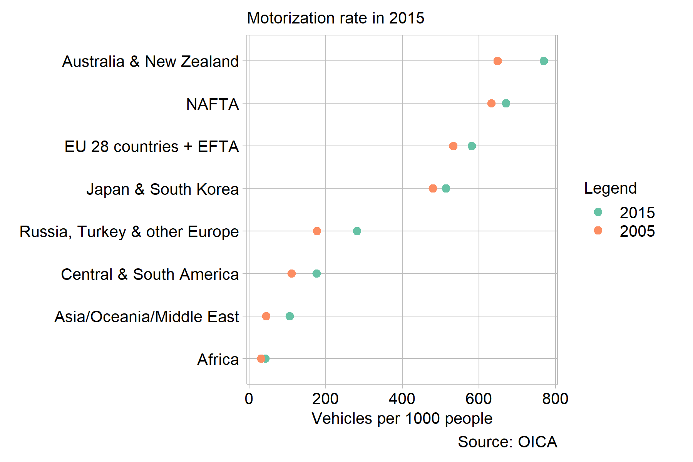

revise graphical lie
================

What kind of lie is it? (See graphical lies slides for types) Look to
put the data in context: add more years? surrounding areas?

The map projection of original is true, uses the Molleweide projection
which more accurately portrays land area (need a citation). Many graphs
use the Mercatur projection, which distorts the globe in such a way that
North American and European countries seem larger.

They avoided value laden colors - their scheme has absolutely no
meaning. Color could be used to make certain countries or continents
more prominent or impart emotional or political biases.

The countries are grouped, roughly by continent. I can only deduce this
was necessary because the map does not have enough space to write each
countrie’s data. Grouping by global region means a single mean can be
displayed, which is representative of that region’s data. Since I am
representing each countries motorization rate on a color scale and not
in a written number, the groupings are not necessary for the data to be
legible.

## Graph design

Data requirements

  - Minimum 20 observations
  - One quantitative variable conveying information about human injury
    or fatality
  - One or two categorical variables, one of which can be time (time
    series)

Normalizing the fatalities would be more appropriate in this case
because it would account for the changing number of participants.
However, after searching, I could not find data for the number of
participants across all racing types and series to match the fatalities
context.

Why is this graph type appropriate? design decisions, especially lie
content and how I fixed it

“showing data more than one way increases our understanding” (Robbins,
[2005](#ref-Robbins:2005)).

## References

Robbins N (2005) Scales. *Creating More Effective Graphs*. 226–291

