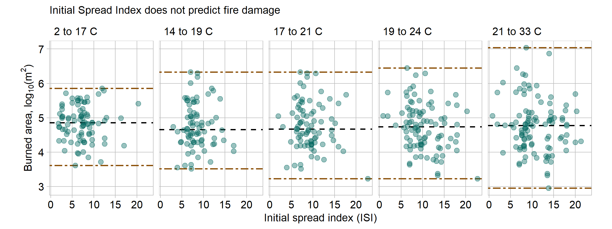

```{r setup, include=FALSE}
library(knitr)
opts_chunk$set(echo = TRUE)
```

Wildfires are a natural disaster experienced across the globe. California and Australia had record-breaking fires in the last two years with unprecendeted environmental and human consequences [@BBC:2018] [@Alexander:2020]. Studying the patterns of wild fires with the intention of modeling and predicting potential blazes is a difficult but important field. This chart explores the relationship between temperature, the Fine Fuel Moisture code (FFMC), and the resulting burned area. [Data](https://archive.ics.uci.edu/ml/machine-learning-databases/forest-fires/) is from fires in the Montesinho natural park in Portugal, taken from 2000 to 2003 [@Cortez:2007]. Each of the 517 dots represents a fire event with environmental data evaluated near the time of ignition.

```{r echo = FALSE, out.width = "100%"}   
    
```

This data is a subset of Cortez's and Morais' published data. They were successfully able to predict fire damage with a number of FWI indices and weather parameters for small fires. They employed a variety of high-level statistical and data mining techniques, and are likely smarter than I am, because I could not find the expected patterns. 

As temperature increases, fires do not tend to burn a greater area. The median burned area is seen as a black horizontal dashed line; there is no discernible trend in the median area. As temperature increases the trend is to increase scatter in the fire sizes. The brown dot-dash lines represent the minimum and maximum data values in that panel; the range increases in every panel. The largest blazes do larger at higher temperatures, which is the only example of this data following my expected behavior.

Initial spread index is a metric included in the Canadian forest fire weather index (FWI) system. The FWI is commonly used to rate fire danger on any given day as well as quantify the intensity and danger of a particular blaze. ISI represents the "expected rate of fire spread" taking into account wind effects and moisture [@FWI]. ISI is designed (and expected) to correlate with blaze intensity, and therefore damaged area. However, the lack of correlation between ISI and burned area suggests this index is ineffective for it's intended purpose. There could be an additional unobserved factor at play, perhaps related how quickly ignition is detected or to the severity of fire suppression response. If a fire with a high ISI is detected quickly it likely prompts a swift and powerful fire suppression response to reduce the damage, resulting in lower burned area.

This data represents the factors relevant to the geographic area in the Montesinho park. There may be variables specific to that area that drive the observed relationship, so these conclusions likely can't be extended to other geography or climates. In other regions with vastly different terrain the factors to predict fire damage are likely different.

## Graph design

A conditional plot is appropriate for this data set because it explores the correlation or dependence between three continuous quantitative variables. Burned area (the 'output' variable) is placed on the y-axis to facilitate easier comparison across the horizontal array of panels with a common vertical axis [@Wainer:2000]. 

Like all of the other plots in this portfolio, it uses the graphclassmate package for consistency and emphasizing the data. Detailed discussion of this theme is found in the [D2 report](https://github.com/severygb/portfolio-severyn-gabe/blob/master/reports/D2-report.md). The median and min and max lines in each panel use different line types and colors to ensure the lines are not confused. There is no legend included to explain minimum and maximum lines because their position bounding the data range is inherently clear. Since there is significant clustering of fire data points, a transparency argument is added to show the density of points rather than a jittering effect, which would distort the continuous quantitative data [@Wilke:2018].

Burned area is highly skewed to smaller values as small fires are much more common than large fires. A log scale is employed for the y-axis because it better represents the distribution [@Robbins:2013b].

## References