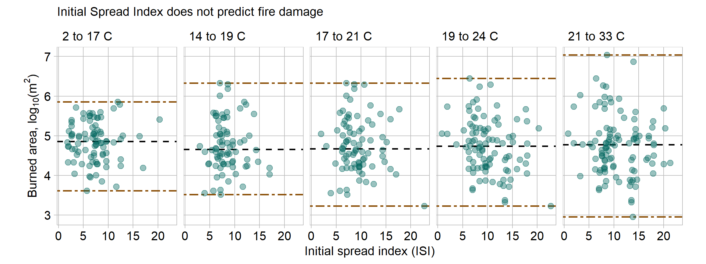

Wildfire Intensity
================

Wildfires are a natural disaster experienced across the globe.
California and Australia had record-breaking fires in the last two years
with unprecendeted environmental and human consequences (BBC,
[2018](#ref-BBC:2018)) (Harriet Alexander and Brickwood,
[2020](#ref-Alexander:2020)). Studying the patterns of wild fires with
the intention of modeling and predicting potential blazes is a difficult
but important field. This chart explores the relationship between
temperature, the Fine Fuel Moisture code (FFMC), and the resulting
burned area.
[Data](https://archive.ics.uci.edu/ml/machine-learning-databases/forest-fires/)
is from fires in the Montesinho natural park in Portugal, taken from
2000 to 2003 (Cortez and Morais, [2007](#ref-Cortez:2007)). Each of the
517 dots represents a fire event with environmental data evaluated near
the time of ignition.

This data is a subset of Cortez’s and Morais’ published data. They were
successfully able to predict fire damage with a number of FWI indices
and weather parameters for small fires. They employed a variety of
high-level statistical and data mining techniques, and are likely
smarter than I am, because I could not find the expected patterns.

As temperature increases, fires do not tend to burn a greater area. The
median burned area is seen as a black horizontal dashed line; there is
no discernible trend in the median area. As temperature increases the
trend is to increase scatter in the fire sizes. The brown dot-dash lines
represent the minimum and maximum data values in that panel; the range
increases in every panel. The largest blazes do larger at higher
temperatures, which is the only example of this data following my
expected behavior.

Initial spread index is a metric included in the Canadian forest fire
weather index (FWI) system. The FWI is commonly used to rate fire danger
on any given day as well as quantify the intensity and danger of a
particular blaze. ISI represents the “expected rate of fire spread”
taking into account wind effects and moisture (CWFIS, [2020](#ref-FWI)).
ISI is designed (and expected) to correlate with blaze intensity, and
therefore damaged area. However, the lack of correlation between ISI and
burned area suggests this index is ineffective for it’s intended
purpose. There could be an additional unobserved factor at play, perhaps
related how quickly ignition is detected or to the severity of fire
suppression response. If a fire with a high ISI is detected quickly it
likely prompts a swift and powerful fire suppression response to reduce
the damage, resulting in lower burned area.

This data represents the factors relevant to the geographic area in the
Montesinho park. There may be variables specific to that area that drive
the observed relationship, so these conclusions likely can’t be extended
to other geography or climates. In other regions with vastly different
terrain the factors to predict fire damage are likely different.

## Graph design

A conditional plot is appropriate for this data set because it explores
the correlation or dependence between three continuous quantitative
variables. Burned area (the ‘output’ variable) is placed on the y-axis
to facilitate easier comparison across the horizontal array of panels
with a common vertical axis (Wainer, [2000](#ref-Wainer:2000)).

Like all of the other plots in this portfolio, it uses the
graphclassmate package for consistency and emphasizing the data.
Detailed discussion of this theme is found in the [D2
report](https://github.com/severygb/portfolio-severyn-gabe/blob/master/reports/D2-report.md).
The median and min and max lines in each panel use different line types
and colors to ensure the lines are not confused. There is no legend
included to explain minimum and maximum lines because their position
bounding the data range is inherently clear. Since there is significant
clustering of fire data points, a transparency argument is added to show
the density of points rather than a jittering effect, which would
distort the continuous quantitative data (Wilke,
[2018](#ref-Wilke:2018)).

Burned area is highly skewed to smaller values as small fires are much
more common than large fires. A log scale is employed for the y-axis
because it better represents the distribution (Robbins,
[2013](#ref-Robbins:2013b)).

## References

BBC (2018) California wildfires: Eight images that reveal scale of
devastation. <https://www.bbc.com/news/world-us-canada-45135098>

Cortez P and Morais A (2007) A data mining approach to predict forest
fires using meteorological data.
<http://www3.dsi.uminho.pt/pcortez/fires.pdf>

CWFIS NRC (2020) Canadian forest fire weather index (fwi) system.
<https://cwfis.cfs.nrcan.gc.ca/background/summary/fwi>

Harriet Alexander NC Laura Chung and Brickwood J (2020) ’Extraordinary’
2019 ends with deadliest day of the worst fire season.
<https://www.smh.com.au/national/nsw/extraordinary-2019-ends-with-deadliest-day-of-the-worst-fire-season-20191231-p53nw0.html>

Robbins N (2013) Scales. *Creating More Effective Graphs*. Chart House,
Wayne, NJ, 226–291
<http://www.nbr-graphs.com/resources/recommended-books/>

Wainer H (2000) *Visual revelations: Graphical tales of fate and
deception from napoleon bonaparte to ross perot.*
(doi:[10.2307/2685574](https://doi.org/10.2307/2685574))

Wilke CO (2018) Handling overlapping points. *Fundamentals of Data
Visualization*. O’Reilly Media, Inc., Sebastopol, CA
<https://serialmentor.com/dataviz/overlapping-points.html>

