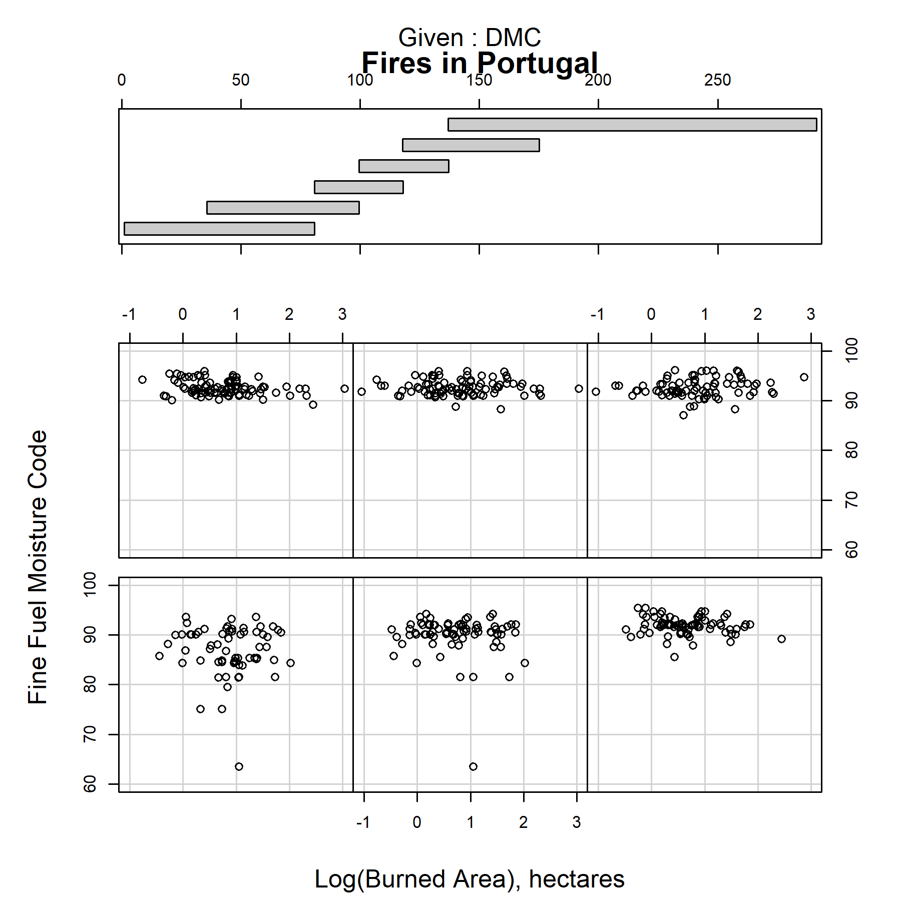

Wildfire Intensity
================

Wildfires are a natural disaster experienced across the globe.
California and Australia had record-breaking fires in the last two years
with unprecendeted environmental and human consequences. Studying the
patterns of wild fires with the intention of modeling and predicting
potential blazes is a difficult but important field. This chart explores
the relationship between temperature, the Fine Fuel Moisture code
(FFMC), and the resulting burned area.
[Data](https://archive.ics.uci.edu/ml/machine-learning-databases/forest-fires/)
is from fires in the Montesinho natural park in Portugal, taken from
2000 to 2003 (Cortez and Morais, [2007](#ref-Cortez:2007)). Each of the
517 dots represents a fire event with environmental data evaluated near
the time of ignition.

As temperature increases, fires tend to burn a greater area. In the
bottom left panel, corresponding to 0C-17C, no fire burned over 100
hectares. When the temperature increases, the largest fires get even
larger. In the top right panel, corresponding to 22-34C, the largest
fires burn over 1000 hectares. Burned area is skewed to smaller values,
as small fires are much more common than large fires.

Fine fuel coisture code (FFMC) is a metric included in the Canadian
forest fire weather index (FWI) system, commonly used to rate fire
danger on any given day as well as quantify the intensity of a blaze.
FFMC measures the moisture content of easily ignited fuels and is an
indicator of flammability (CWFIS, [2020](#ref-FWI)). FFMC and area
burned do not appear to have a correlation in these fires.
Interestingly, the other FWI metrics included in the data (duff moisture
code, drought code, initial spread index) behaved in the same way - with
little to no correlation present. This suggests an additional unobserved
factor at play, perhaps related how quickly the burn is detected or to
the severity of fire suppression response.

This represents the factors relevant to the geographic area in the
Montesinho park. There may be variables specific to that area that drive
the observed relationship, so these conclusions can likely be extended
to a similar geography or even climate. In other regions with vastly
different terrain, the factors to predict fire damage are likely
different and will require a similar study to determine them.

## Graph design

Data requirements: D6 multivariate

  - Minimum 20 observations
  - Three or more quantitative variables
  - Time is excluded as a variable
  - Categorical variables are possible, depending on the graph type.

A conditional plot is appropriate for this data set because it explores
the correlation or dependence between three continuous quantitative
variables. Burned area (the ‘output’ variable) is placed on the x-axis
to facilitate easier comparison across the panels. Like all of the other
plots in this portfolio, it uses similar design choices for consistency
and emphazising the data.

**Graph improvements**

  - caption for sourcing
  - consistent font size

## References

Cortez P and Morais A (2007) A data mining approach to predict forest
fires using meteorological data.
<http://www3.dsi.uminho.pt/pcortez/fires.pdf>

CWFIS NRC (2020) Canadian forest fire weather index (fwi) system.
<https://cwfis.cfs.nrcan.gc.ca/background/summary/fwi>

